

# 🏋️ Gym Manager Desktop

### Local-first Windows operations software for gym memberships, money, attendance, inventory, staff workflows, reporting, and recovery

**Flutter** · **Dart** · **BLoC / Cubit** · **Drift / SQLite** · **Windows Desktop**

> **Development / Integration · Release Hardening**

---

> [!IMPORTANT]
> **Visuals & Data Notice**  
> The visuals in this repository are case-study presentation frames built from the current Gym Manager desktop UI. Visible operational values are demo / UAT data unless explicitly stated otherwise. The images are not evidence of production deployment, customer adoption, or business impact.

> [!NOTE]
> **Private Source**  
> The commercial implementation remains private. This public repository contains only sanitized engineering explanations, selected product visuals, architecture diagrams, and dated audit evidence.

---

## Overview

Gym Manager Desktop is a **Windows-first, local-authority gym operations application** designed around a shared reception workstation.

The system connects business areas that become difficult to keep consistent when handled as isolated screens or spreadsheets:

- membership contracts and entitlement,
- receivables, collections, refunds, and expenses,
- attendance and check-in,
- POS / stock movement,
- prospects and retention work,
- staff roles, approvals, and auditability,
- operational reporting,
- backup, restore, and startup recovery.

The engineering focus is not simply CRUD. The core problem is preserving **explainable operational history** when a payment changes debt, a sale affects stock, a refund corrects a posted transaction, attendance depends on entitlement, or a restore rebuilds the application state.

---

# Product Tour

## 01 — Dashboard

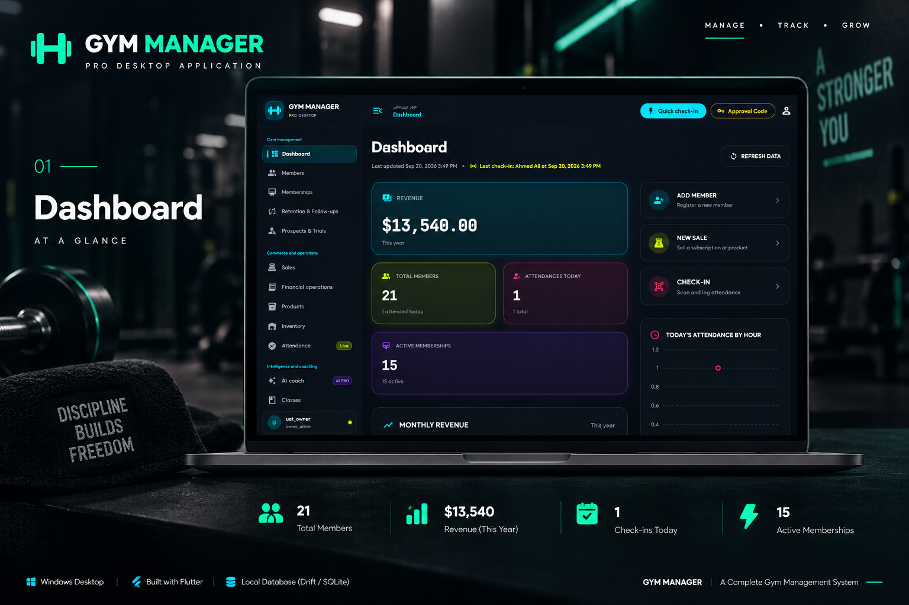

A single operational view for key membership, attendance, revenue, and quick-action signals.

---

## 02 — Members Management

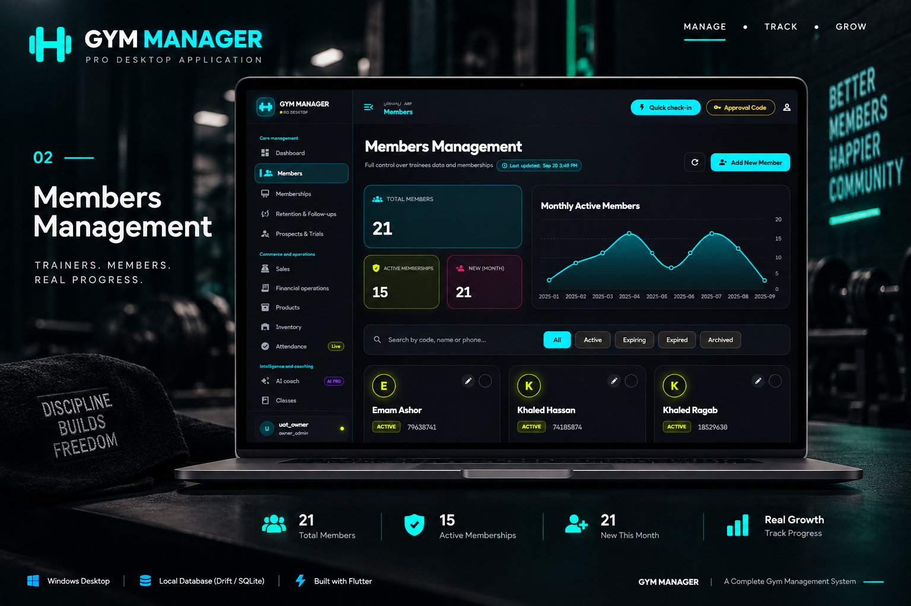

Member discovery, status filtering, active-membership visibility, and operational member management.

---

## 03 — Subscription Packages

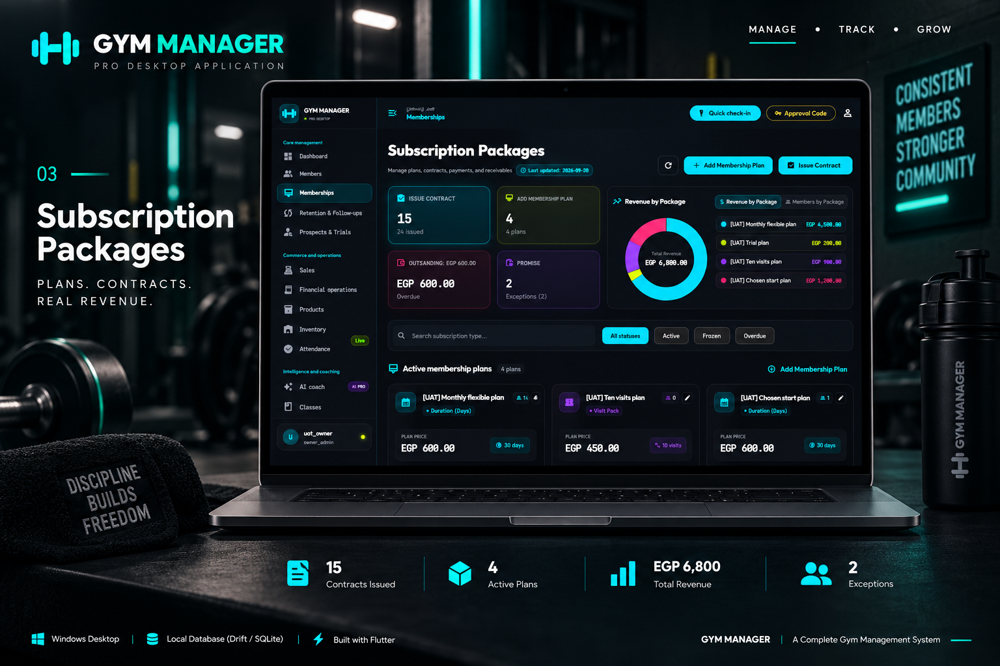

Plan definition, contract issuance, receivables visibility, package revenue, and membership lifecycle management.

---

## 04 — Prospects & Leads

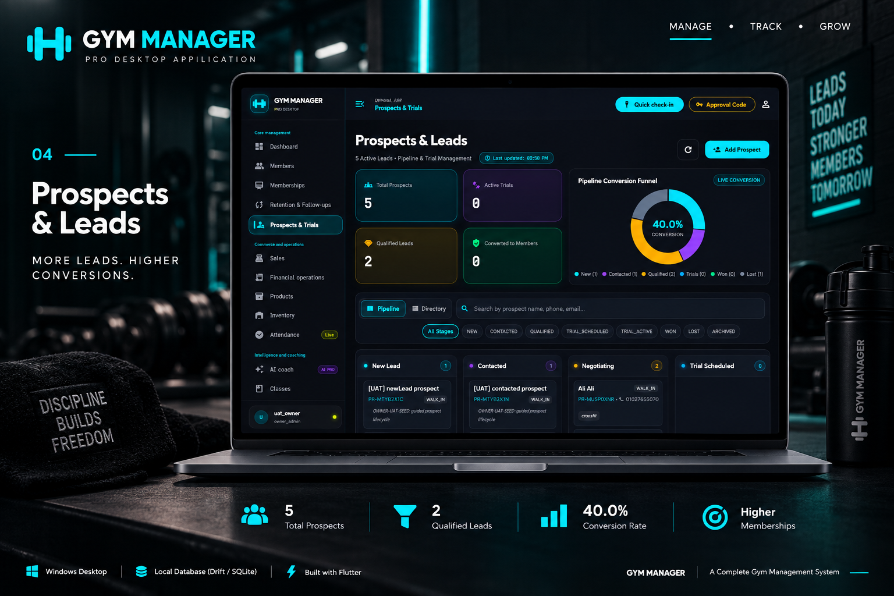

Lead pipeline, trial state, qualification stages, and conversion-oriented follow-up.

---

## 05 — Financial Operations

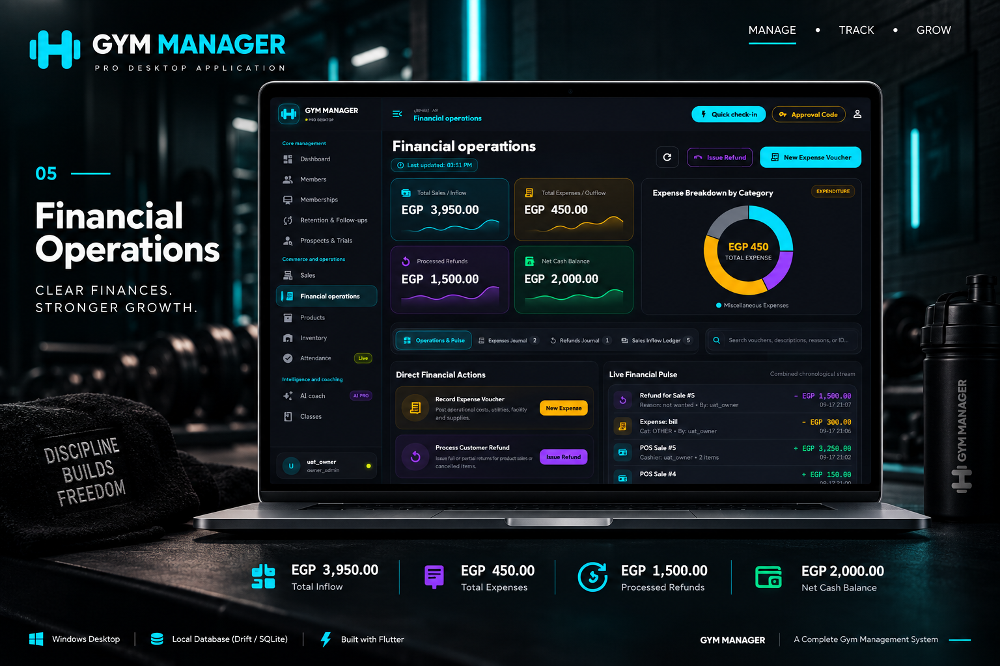

Cash inflow, expenses, refunds, financial journals, and chronological operational finance activity.

---

## 06 — Attendance

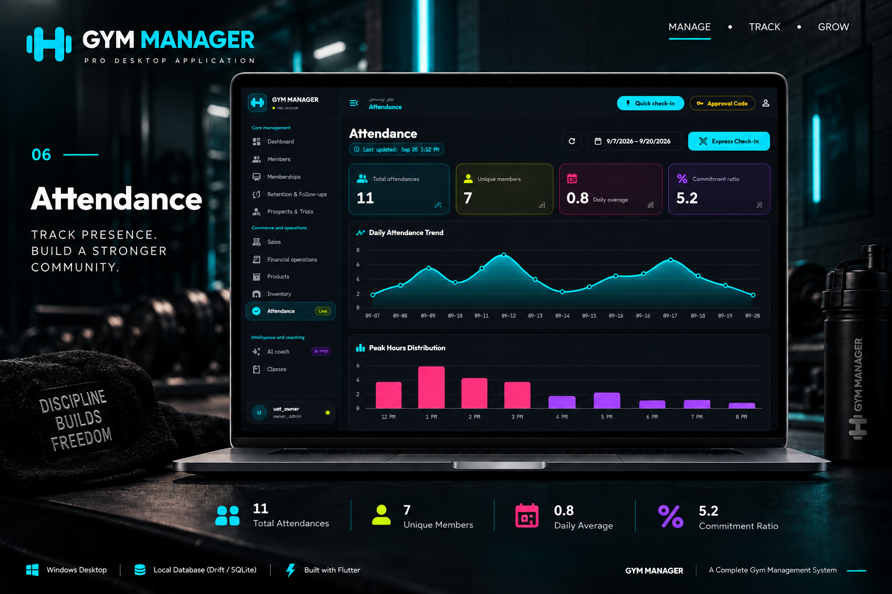

Check-in metrics, attendance trends, peak-hour analysis, and daily operational visibility.

---

## 07 — Reports & Analytics

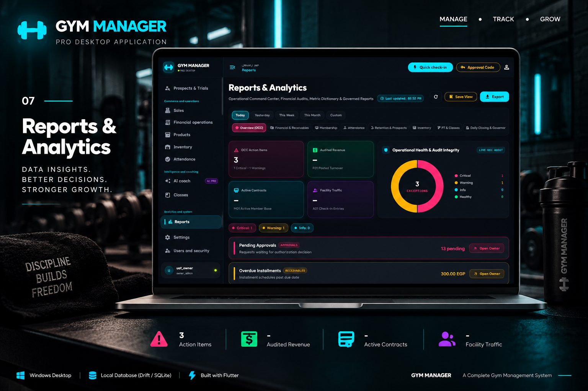

Governed operational reports across finance, memberships, attendance, retention, inventory, PT/classes, and closing controls.

---

## 08 — Users & Security

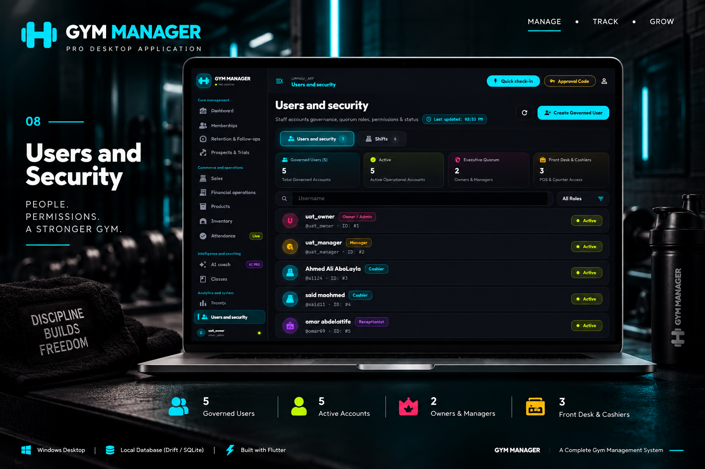

Local staff accounts, role grouping, account status, approval-related access, and shared-workstation accountability.

---

## 09 — Member Profile

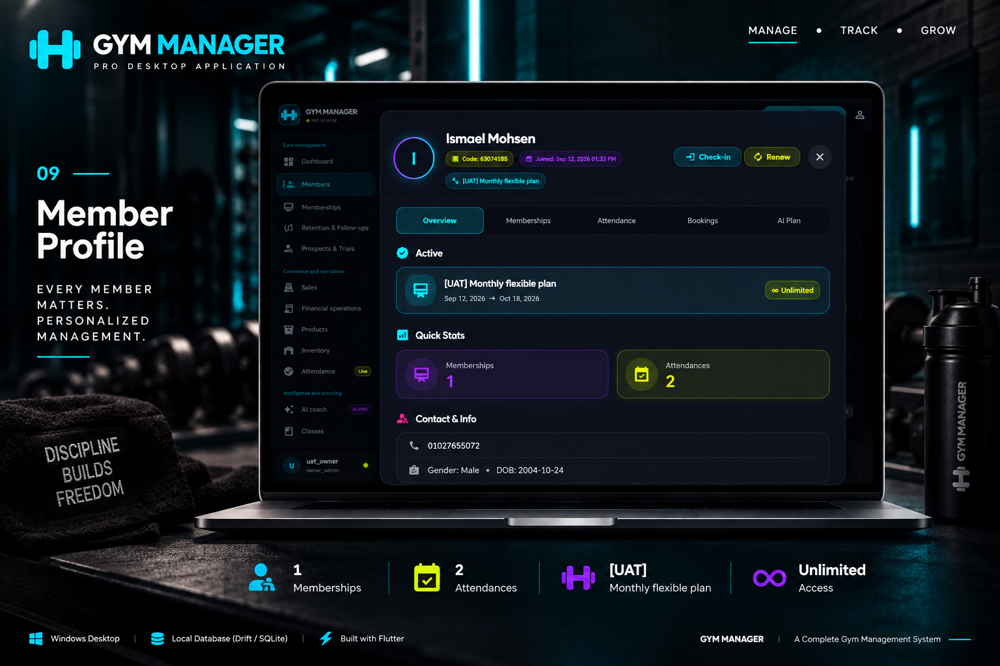

A consolidated member view connecting membership status, attendance, contact data, renewal, and check-in actions.

---

# Operating Context

The implementation is shaped by several concrete constraints:

- **Windows desktop is the current application platform.**
- Core business data is persisted locally through **Drift / SQLite**.
- Core membership and payment workflows do not depend on a cloud business backend.
- Arabic and English localization resources exist.
- Staff may share one workstation, making session, role, approval, and audit concerns important.
- Optional external services such as AI or update infrastructure are not the authority for core business records.

This makes the project closer to a **local business operations system** than a typical mobile CRUD app.

---

# Architecture

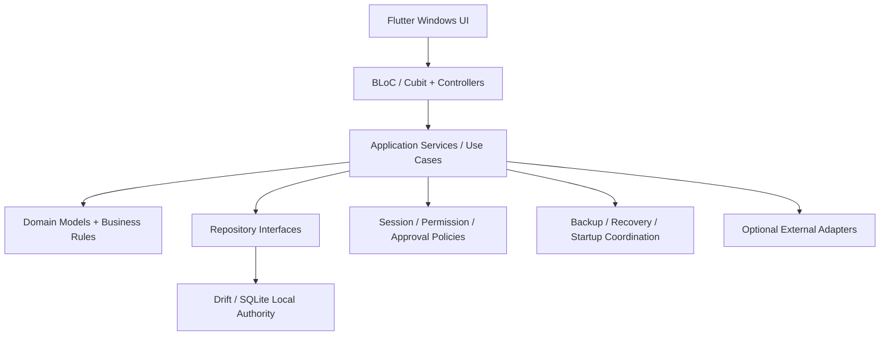

The current implementation has evolved toward an owned application context, explicit application services, local repositories, lifecycle checks, and recovery-aware startup behavior.

---

# Financial Correctness

The most important engineering story in Gym Manager is the separation between **what was sold**, **what is owed**, and **what was actually paid**.

Key design ideas:

- membership contracts preserve historical terms,
- financial obligations are distinct from payment allocations,
- outstanding balance is derived from posted financial facts instead of treated as a free-edit field,
- corrections and refunds preserve links to prior history,
- exact-money / rate / time primitives exist in the implementation.

This prevents a membership record from being mistaken for proof that money was collected.

---

# POS, Stock, and Corrections

A sale is not just a receipt screen. It affects multiple operational records.

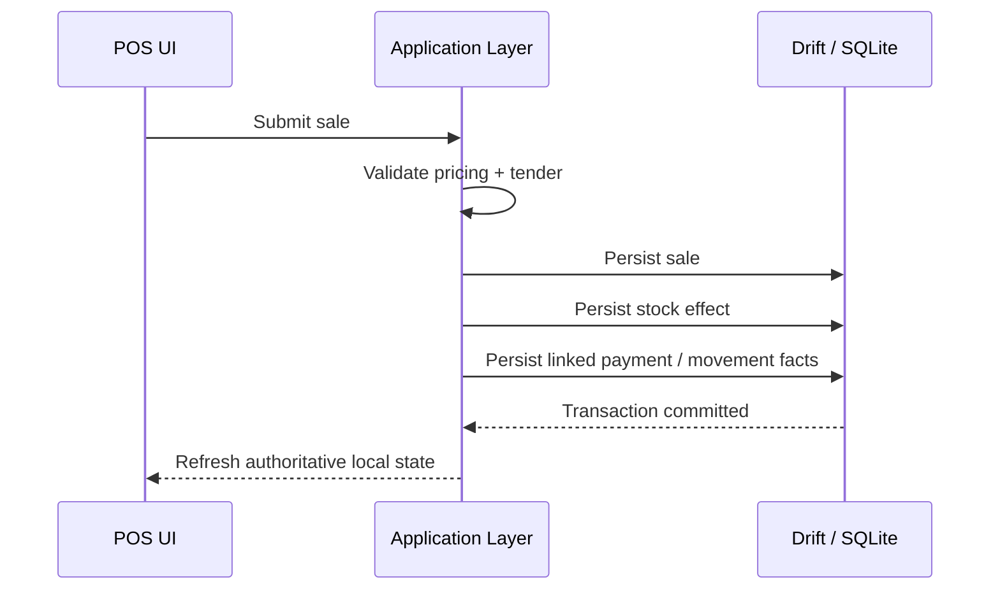

A bounded audit run verified a selected POS journey that included successful sale posting and stock decrement. That evidence is useful, but it is not presented here as proof that every POS/refund edge case is release-qualified.

---

# Attendance & Entitlement

Attendance is treated as operational history rather than a disconnected counter.

The system connects:

- member identity,
- current membership / entitlement,
- check-in actions,
- attendance records,
- reporting and member history.

This creates a useful basis for member follow-up, retention, and operational traffic analysis.

---

# Staff Accountability

A shared workstation creates a different security model from a single-user consumer app.

The implementation contains:

- local account authentication and session handling,
- default permission profiles,
- individual staff identities,
- protected-operation approval concepts,
- audit-oriented transaction paths.

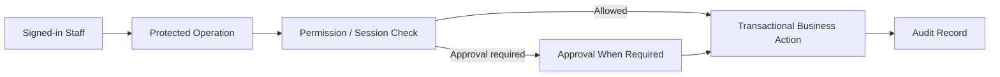

The public case study intentionally does **not** claim universal enforcement across every legacy path. Authorization convergence remains part of hardening.

---

# Local Data, Startup, and Recovery

A local-first desktop product has to treat recovery as an application lifecycle problem, not just a “copy database” button.

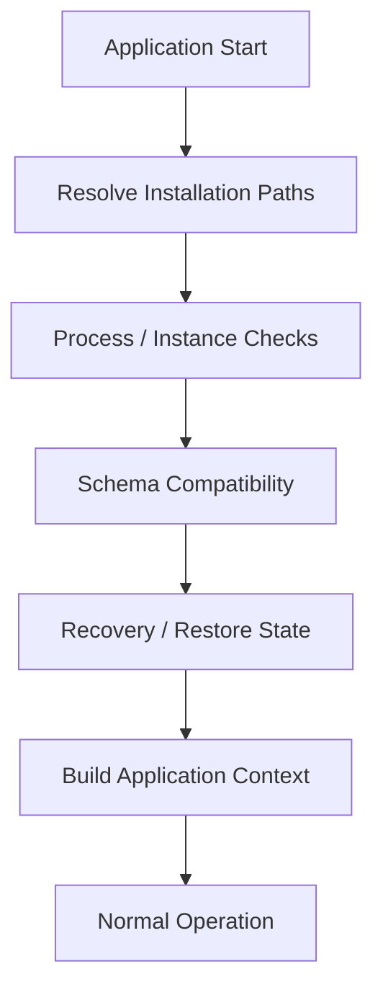

Verified implementation evidence includes:

- schema versioning,
- local startup preflight,
- application-context rebuild paths,
- encrypted backup container code,
- logical snapshot / validation behavior,
- selected recovery and migration tests.

A real packaged disaster-recovery rehearsal is still separate from these bounded checks.

---

# Reporting

The reporting catalog is broader than a single dashboard.

The audited repository defines **60 report metric definitions** with explicit knowledge states and domain/query metadata. Report surfaces cover operational areas such as finance, memberships, attendance, retention/prospects, inventory, PT/classes, and operational closing.

The case-study screenshots intentionally show only a curated subset.

---

# Optional AI Boundary

The codebase includes optional Gemini assistance behind constrained context and validation boundaries.

The important architectural rule is:

> **AI is optional assistance, not the authority for core membership, finance, attendance, or inventory state.**

The local business system continues to own business truth independently of AI availability.

---

# Technology Stack

| Area | Technology / Approach |
|---|---|
| UI | Flutter / Dart |
| Platform | Windows Desktop |
| State | BLoC / Cubit + local controllers |
| Persistence | Drift / SQLite |
| Architecture | Layered domain / application / repository boundaries |
| Localization | Arabic + English |
| Security | Local sessions, roles, permissions, approvals, audit concepts |
| Reliability | Startup checks, schema admission, backup / recovery workflows |
| Optional AI | Gemini REST integration with validation boundaries |
| Testing | Unit / domain / application / integration-style local tests |

---

# Verified Repository Evidence

**Audit date: 2026-09-19**

| Metric | Verified value |
|---|---:|
| Platform runners currently present | **Windows only** |
| Drift schema version | **18** |
| Registered Drift table classes | **119** |
| Shell destination entries | **17** |
| Report metric definitions | **60** |
| Default permission profiles | **4** |
| Permission catalog codes | **133** |
| Canonical UI languages | **2** |
| Test files under `test/` | **325** |
| Bounded audit tests completed | **96** |
| Bounded audit tests passed | **95** |
| Bounded audit tests failed | **1** |
| Static-analysis issues in audited `lib test` scope | **61** |
| Static-analysis errors in that scope | **3** |

> `325 test files` does **not** mean 325 passing tests or 325 individual test cases.  
> The bounded run is intentionally presented as dated evidence, not a green full-suite claim.

---

# Testing & Quality — Audit Snapshot

The 2026-09-19 audit selected bounded coverage across important technical areas rather than running an expensive complete release qualification.

Selected passing areas included:

- exact money / rate / time foundations,
- startup and isolation states,
- application-context paths,
- financial journey slices,
- contract → charge → collection behavior,
- POS sale / stock behavior,
- retention / timeline interaction,
- recovery and backup candidate checks,
- synthetic schema migration,
- optional-AI disabled / permission boundaries.

The same audit also found current hardening work:

- **95 of 96** bounded tests passed,
- one selected permission-profile expectation failed,
- analysis reported **61 issues**, including **3 test-interface errors**,
- the full required release suite was not established as green,
- packaging, real hardware, real update execution, and production deployment were not qualified.

The correct public interpretation is:

> **Substantial automated verification exists, but release qualification is still in progress.**

---

# Current Status

**Development / Integration · Release Hardening**

The current repository demonstrates substantial implementation across:

- memberships and receivables,
- financial operations,
- POS and inventory,
- attendance,
- member history,
- prospects / retention,
- staff security workflows,
- reporting,
- backup / recovery,
- optional AI assistance.

It should **not** be described as a verified production release yet.

---

# Current Limitations

This case study does **not** claim:

- production deployment,
- active paying customers,
- verified revenue or recovered revenue,
- reduced churn or time saved,
- complete security enforcement,
- a fully green full test suite,
- zero defects,
- multi-branch / enterprise deployment,
- multi-device remote write synchronization,
- Android / iOS / web product editions,
- proven compatibility with every scanner or printer,
- proven disaster-recovery operations on deployed customer data.

---

# Source & Publication Notice

The commercial implementation remains private.

This public case study is designed to demonstrate:

- local-first desktop architecture,
- financial-domain modeling,
- transactional persistence,
- cross-domain operational consistency,
- database evolution,
- staff accountability,
- recovery-aware desktop engineering.

The case-study visuals are selected presentation frames derived from the current product UI and use demo / UAT-style data.

---

## GYM MANAGER

**Manage · Track · Grow**

*A Complete Gym Management System*

